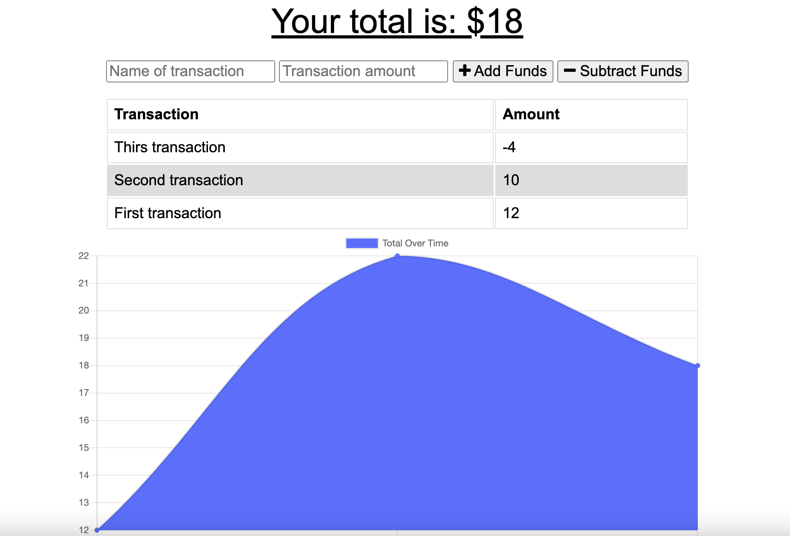

# expense-tracker-pwa

## Deployed Application Link

https://expense-tracker-pwa-dp.herokuapp.com/

## Table of Contents

- [expense-tracker-pwa](#expense-tracker-pwa)
  - [Deployed Application Link](#deployed-application-link)
  - [Table of Contents](#table-of-contents)
  - [Description](#description)
  - [Key Features](#key-features)
  - [Installation](#installation)

## Description

A budget tracker which allows you to track expenses and income no matter whether you're online or offline.

## Key Features

- Add expenses and income in a singular interface
- Visually examine your total budget fluctuations in a graph
- Track all your past expenses and incomes in a handy list



## Installation

- Clone the GitHub project onto your local machine

```
git clone https://github.com/dominikacookies/expense-tracker-pwa
```

- Navigate into the project
- Open the project in VSCode
- Open the integrated terminal
- In the terminal, enter:

  ```
  npm i
  ```

  to install all of the packages.

  Next, to start the application enter

  ```
  npm run start
  ```

Ensure that you have installed node.
